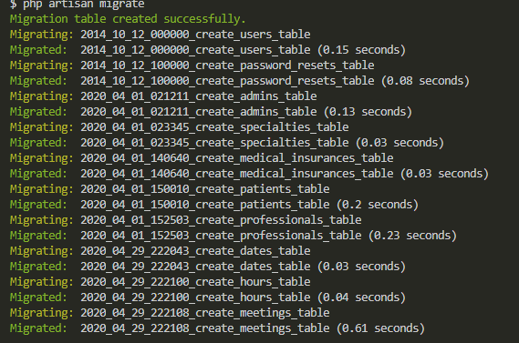

# DH - Salud

## Comandos Necesarios:

Por https :

```markdown
git clone https://github.com/Brunidas/DH-Salud.git
```

Por ssh :

```markdown
git clone git@github.com:Brunidas/DH-Salud.git
```

En donde este instalado php
Instalar Composer

Dentro del directorio DH-Salud correr los comandos
composer install

Craer un archivo llamado ".env", el de las confugurariones de Laravel. En el cual hay que especificar que la base de datos de llamara "laravel" y correra en MySQL

Lo que sigue es usar el comando :

```markdown
php artisan key:generate
```

Se debe crear una base de datos llamda laraver, y se tiene que correr las migraciones
Se corre con el comando :

```markdown
php artisan migrate
```

Como resultado deberia aparencer algo como esto
</img>
Luego se corre el comando:

```markdown
php artisan db:seed
```

Y con este comado se corre el proyecto:

```markdown
php artisan serv
```

<p align="center"></p>

<p align="center">
<a>

</a>
</p>
